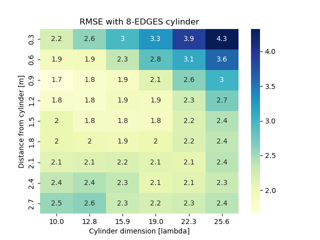
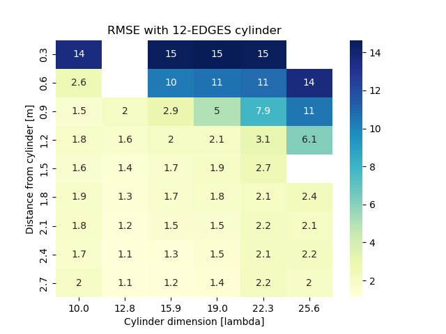
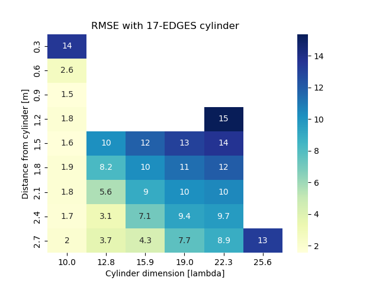

# Cylinder Discretization Selection for Sionna Ray Tracing Analysis with Double Edge Implementation

## Simulation and Specifications

Simulations were performed by varying the cylinder discretization among 8, 12, and 17 segments, and changing the observation distance from $2\lambda$ to $20\lambda$.
The cylinder radius was varied between $10\lambda$ and $25.6\lambda$.

The carrier frequency is $f_c = 2\text{ GHz}$, corresponding to a wavelength of $\lambda = 0.15\text{ m}$.

Depending on the observation distance, the setup operates in:
* **Fresnel region (Radiating Near-Field):** where $r \gg \lambda$ but $r < \frac{2D^2}{\lambda}$
* **Reactive Near-Field / Near-Field:** where $r > \lambda$

## Obtained Results

The Root Mean Square Error (RMSE) results in the shadow zone, plotted against distance for the different discretizations, are shown below:

## Conclusions

* For the distance $r \gg \lambda$, the optimal discretization is **12 segments**.
* For the distance $r > \lambda$, the optimal discretization is **8 segments**. With higher discretizations, the Ray Tracing algorithm fails to compute the field entirely.

Furthermore, the choice of the optimal discretization is independent of the cylinder radius.

To represent the curvature using the curvature parameter, the relationships are as follows:

### Fresnel Region
$$
\frac{E^2}{R} \approx \frac{5.85 \cdot \lambda \cdot D}{10}
$$

### Radiating Near-Field
$$
\frac{E^2}{R} \approx \frac{2.67 \cdot \lambda \cdot D}{10}
$$
